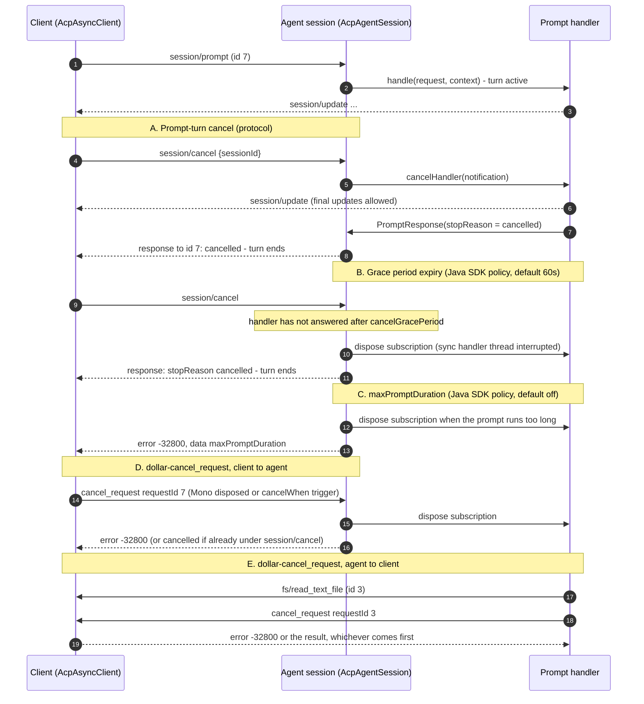

ACP has two separate cancellation mechanisms. This page covers both, plus two things the SDK adds
that the protocol itself doesn't define.

For the protocol rules themselves, read the spec directly rather than relying on a restatement here:
[Cancellation](https://agentclientprotocol.com/protocol/v1/cancellation) (`$/cancel_request`,
cooperative cancellation, `-32800`, and the spec's own cascading-cancellation diagram) and
[Prompt Turn: Cancellation](https://agentclientprotocol.com/protocol/v1/prompt-turn#cancellation)
(`session/cancel`, the `cancelled` stop reason).

## The two mechanisms

**`session/cancel`** (a notification) asks the agent to end the current prompt turn. The turn stays
active until the cancelled prompt actually answers: a new prompt sent in between gets `-32600`
(invalid request), the same as any prompt sent while another is already running on that session. The
handler should answer with `StopReason.CANCELLED`.

**`$/cancel_request`** cancels any single in-flight request, in either direction. Disposing a
request's `Mono` (directly, via `.timeout(...)`, or the SDK's own request timeout: 30s on the
client, 60s on the agent) sends `$/cancel_request` once, after the request was written; the caller's
`Mono` ends immediately and a late answer from the peer is discarded. A **graceful** variant keeps
waiting for the real answer:

```java
client.prompt(new PromptRequest(sessionId, List.of(new TextContent("..."))))
    .contextWrite(RequestCancellation.cancelWhen(someTrigger));
```

```java
client.cancel(new CancelNotification(sessionId));  // session/cancel, the prompt-turn cancel
```

## Java SDK policy: the grace period and `maxPromptDuration`

Neither of these exists in the protocol, and no peer SDK has an equivalent (the closest precedent is
an undocumented 1-second graceful-cancel timeout in the Kotlin SDK). They exist for a structural
reason: the spec requires every cancelled prompt to be answered `cancelled`, and a session allows
only one active turn, so a handler that never answers would leave its session busy forever with
nothing able to recover it.

- **Cancel grace period** (`PromptTimeouts.cancelGracePeriod`, default 60 seconds): if the handler
  hasn't answered this long after `session/cancel`, the SDK cancels the handler's subscription
  (interrupting its thread, for a sync handler) and answers `cancelled` on its behalf.
- **`maxPromptDuration`** (`PromptTimeouts.maxPromptDuration`, off by default): a hard ceiling on one
  turn's length, answered `-32800` with data `{"maxPromptDuration": "<ISO-8601>"}` when it fires (or
  `cancelled`, if the prompt was already being cancelled).

`Duration.ZERO` disables either one. Exactly one answer is ever sent per prompt. **Document both of
these as SDK policy, not protocol behavior**: they're specific to this implementation.

```java
AcpAgent.async(transport)
    .cancelGracePeriod(Duration.ofSeconds(60))
    .maxPromptDuration(Duration.ofMinutes(30))
    // ...
    .build();
```

## Noticing a cancellation from inside a `@Prompt` method

A `@Prompt` handler finds out about a cancellation the same way regardless of which of the four
triggers caused it (`session/cancel` or `session/close` for its session, `$/cancel_request` for its
own request, or the agent itself ending it: the cancel grace period or `maxPromptDuration` passing,
or the connection closing):

```java
@Prompt
PromptResponse prompt(PromptRequest req, SyncPromptContext ctx) {
    for (Step step : plan) {
        if (ctx.isCancelled()) {
            return PromptResponse.cancelled();
        }
        step.run(ctx);
    }
    return PromptResponse.endTurn();
}
```

`SyncPromptContext.isCancelled()` is a poll: check it between steps of a long-running handler. For
work you can't poll, such as a subprocess or an outstanding HTTP call that needs aborting,
`onCancel(Runnable)` registers a callback that runs once, on whichever thread delivers the
cancellation, so it must be quick and must not block. The async `PromptContext.whenCancelled()`
returns a `Mono<Void>` that completes (empty) on cancellation, for composing into a Reactor pipeline,
for example `work.takeUntilOther(context.whenCancelled())` to stop a chain of operators.

Once `isCancelled()` is true, it stays true. After `session/cancel`, answer within the cancel grace
period with `PromptResponse.cancelled()`, as the example above does; after `$/cancel_request` the SDK
has already answered and interrupted the handler's thread, so whatever the handler eventually returns
is simply discarded.

## The full sequence



Steps labeled "Java SDK policy" (B and C above) are this SDK's behavior, not the protocol's; the
rest follows the spec directly.

## What's unchanged, and what's new

The agent side's incoming notification handlers are **not** ordered relative to responses, and
`session/cancel` takes effect on the inbound thread before any later message is handled.

A behavior change worth knowing if you're upgrading: a client-side prompt timeout now actually
cancels the turn at a Java agent (it used to let the agent keep running after the client gave up).
Raise `requestTimeout` for genuinely long prompts if the old behavior was load-bearing anywhere.

## Related

<CardGroup cols={2}>
  <Card title="Concepts" icon="compass" href="/docs/acp-java-sdk/concepts">
    The prompt turn, and why session/cancel doesn't end it by itself
  </Card>
  <Card title="Migration Guide" icon="arrow-right-arrow-left" href="/docs/acp-java-sdk/migration-0.80">
    The full session/cancel behavior change from 0.18.0
  </Card>
</CardGroup>
