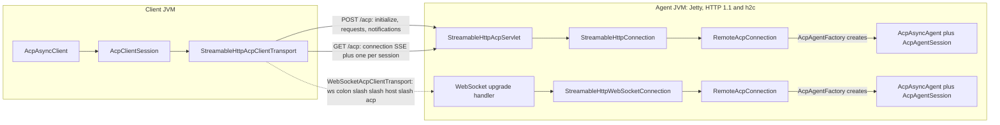

ACP's wire rules for Streamable HTTP and WebSocket come from the transport RFD, not the v1 transports
page (which still calls Streamable HTTP a draft):
[Streamable HTTP and WebSocket Transport](https://agentclientprotocol.com/rfds/streamable-http-websocket-transport).
This page covers this SDK's implementation of it.

## stdio

The default transport: the client spawns the agent as a child process and they exchange
newline-delimited JSON over stdin/stdout. The agent writes its logs to stderr.

**Closing a stdio client lets the agent exit by itself.**
`StdioAcpClientTransport.closeGracefully()` closes the agent's standard input first and waits up to
`END_OF_INPUT_WAIT_MILLIS` (2 seconds) for the agent to exit on its own; only an agent still running
after that gets SIGTERM, and is killed 5 seconds later if it still hasn't stopped. A Java SDK stdio
agent treats end of input as a half-close, not a cancellation: it answers every request already
received, flushes, and exits 0. Exit code 143 now means the agent ignored end of input; 137 means it
was killed. The stop is logged exactly once, even when `close()` follows `closeGracefully()` in a
try-with-resources block.

**`System.in` has a sharp edge.** Closing a `StdioAcpAgentTransport` built on `System.in` does not
release it: its reader thread stays blocked until the next line arrives or input ends, because a read
of `System.in` cannot be interrupted. Pass explicit streams, or use `acp-test`'s in-memory transport,
in embedders and tests.

**The client's own process doesn't exit when the agent process does.**
`StdioAcpClientTransport.awaitProcessExit()` (renamed from `awaitForExit()`) blocks until the agent
process itself exits, as distinct from `awaitTermination()`, which completes when the *transport*
ends (which can happen first, for instance on a graceful close). A thread blocked in
`awaitProcessExit()` that's interrupted throws `CancellationException` with the interrupt flag kept.
Sending through a transport after it's closed fails with `AcpConnectionException` ("The transport is
closed") rather than silently dropping the message and leaving the caller to wait out a timeout.

**The agent process inherits the client's whole environment by default.** Every environment variable
the client process has, including secrets, reaches the agent subprocess unless you say otherwise.
`AgentParameters.Builder.inheritEnvironment(false)` starts the process from an empty environment
instead, with only the "safe" defaults (`HOME`, `PATH`, `USER`, and similar) and whatever
`addEnvVar(...)` adds on the builder:

```java
var params = AgentParameters.builder("my-agent")
    .inheritEnvironment(false)
    .addEnvVar("GEMINI_API_KEY", apiKey)   // the only secret this agent actually needs
    .build();
```

## Streamable HTTP and WebSocket

### ACP over HTTP needs almost nothing from a web framework

| A general web abstraction has | ACP needs |
|---|---|
| Routing, path variables, many endpoints | One path, `/acp` |
| Every HTTP method | `POST`, `GET`, `DELETE` |
| Content negotiation, multipart, cookies, forms | A JSON body in, a few known headers |
| Arbitrary response types | Three replies: JSON, empty, or an SSE stream |
| Binary frames, extensions | WebSocket text frames |
| Filters, interceptors, middleware | None: the framework's own run before the host |

The host contract is about eight small types, and a host is a few hundred lines. That's why each
framework's integration is a thin layer rather than a reimplementation of the protocol.

### Identity

| Identity | Carried by | Meaning |
|---|---|---|
| `Acp-Connection-Id` | HTTP header, set on the `initialize` response and the WebSocket upgrade | One connection equals one agent from the `AcpAgentFactory` |
| `Acp-Session-Id` | HTTP header on session-scoped POST/GET | Which session's SSE stream a message belongs to |
| `sessionId` | JSON-RPC params | The ACP session; must agree with the header |

### Method routing

| Scope | Methods |
|---|---|
| Connection (no `Acp-Session-Id` needed) | `initialize`, `authenticate`, `logout`, `session/new`, `session/list`, `providers/*`, `$/cancel_request` |
| Session (`Acp-Session-Id` required) | `session/prompt`, `session/set_mode`, `session/set_config_option`, `session/cancel`, `session/close` |
| Session (header optional) | `session/load`, `session/resume` (may pre-open the stream), `session/fork` (uses the parent session), `session/delete` |
| Default (extensions, anything unrecognized) | Session-scoped if the params carry a `sessionId`, otherwise connection-scoped |

Agent-to-client calls (`session/update`, `session/request_permission`, `fs/*`, `terminal/*`) travel
on the session's own stream.

### How a connection becomes an agent



Each new connection, whether an `initialize` POST or a WebSocket upgrade, gets a
`RemoteAcpConnection`, which asks the `AcpAgentFactory` for a fresh agent bound to a
connection-scoped transport. Annotated agents get this through
`AcpAgentSupport.Builder.buildFactory()`; the handler bean it wraps is shared across every
connection, so it must be thread-safe.

```java
AcpAgentFactory agents = AcpAgentSupport.create(new MyAgent()).buildFactory();
var server = new StreamableHttpAcpAgentTransport(0, AcpJsonMapper.createDefault(), agents);
server.start().block();  // http://localhost:<server.getPort()>/acp and ws://.../acp
```

### Plain `http://` is first-class

The client probes with a bodiless GET so an h2c (HTTP/2 cleartext) server can upgrade the connection;
otherwise it falls back to pinned HTTP/1.1. The built-in Jetty listener serves both HTTP/1.1 and h2c,
with `maxConcurrentStreamsPerConnection` defaulting to 1024.

### The mountable servlet

`StreamableHttpAcpServlet(mapper, factory)` works in any Servlet 6 container, with async support
enabled; `init()`/`destroy()` drive its lifecycle. A mapper-less overload,
`StreamableHttpAcpServlet(factory)`, defaults to `AcpJsonMapper.createDefault()`, the same convenience
`StreamableHttpAcpClientTransport(URI)`, `WebSocketAcpClientTransport(URI)`, and
`StreamableHttpAcpAgentTransport(int port, AcpAgentFactory)` all have, matching what the stdio
transports already offered.

### Shutdown

Closing the servlet (`destroy()`, `closeGracefully()`) or the standalone listener waits at most
`StreamableHttpAcpAgentTransportOptions.shutdownTimeout` (default 5 seconds) for connected agents to
finish, then closes everything else at once; an `initialize` still in flight when shutdown starts is
answered `503` immediately.

**Under Spring Boot specifically**, graceful shutdown waits for every open SSE stream
(`spring.lifecycle.timeout-per-shutdown-phase`, 30 seconds by default) before `destroy()` even runs.
Call `servlet.closeGracefully()` yourself from a `SmartLifecycle.stop()` in the default phase, rather
than relying on `destroy()` alone, or that 30-second wait looks like a hang.

### Port 0 and other options

Pass port `0` to listen on an ephemeral port; call `getPort()` after `start()` to get the port that
was actually bound. `StreamableHttpAcpClientTransportOptions.maxSseStreams` defaults to 64 (one per
open session, plus the connection stream); raise it if a single client holds many sessions open at
once.

## Deployment topologies

Where ACP actually listens depends on how the agent is built and served. One table, one port column
each:

| How the agent is served | ACP HTTP + WebSocket | The app's own traffic (if any) |
|---|---|---|
| Plain Java (no framework) | One port, the SDK's own server | n/a |
| Quarkus | Quarkus's own HTTP port, alongside the app's routes | Same port |
| Micronaut | A second port (`acp.agent.transport.http.port`) | Micronaut's own port (`micronaut.server.port`) |
| Spring Boot, non-web application | One port, the SDK's own server | n/a |
| Spring Boot, servlet web application | The app's own port, HTTP/SSE only (no WebSocket today) | Same port |

- **Plain Java**, with no framework at all: the SDK's own server serves ACP over HTTP and WebSocket on
  one port.
- **Quarkus** serves ACP over HTTP and WebSocket on Quarkus's own HTTP port, alongside the
  application's other routes. One server.
- **Micronaut** keeps the application's own traffic on Micronaut's server
  (`micronaut.server.port`), while ACP over HTTP and WebSocket runs on a second port
  (`acp.agent.transport.http.port`). Two servers in one JVM: two ports, and separate TLS, security and
  metrics configuration for each.
- **A Spring Boot web application** (a servlet container such as Tomcat) serves ACP over HTTP and SSE
  on the application's own port today, through the mounted servlet; there's no WebSocket upgrade in
  this mode yet. A listener mode, serving ACP on a separate port the way Micronaut does, is coming for
  0.80.0.
- **A Spring Boot non-web application** has no servlet container, so the SDK's own server serves ACP
  over HTTP and WebSocket on its own port, the same shape as plain Java.

Wherever the SDK's own listener serves ACP, that port binds `127.0.0.1` by default, not every
interface: plain Java, Micronaut's second port, and a Spring Boot non-web application. See
**Safe by default** below for how to expose it deliberately.

<Note>
**Planned**: WebSocket support on the application's own port in a servlet container (Tomcat, Jetty,
Undertow) and in Micronaut, through a standard Jakarta WebSocket endpoint, so a web application
wouldn't need a second port just for the WebSocket upgrade. Not available yet.
</Note>

<Tip>
**Safe by default.** The SDK's own listener binds `127.0.0.1` (and `::1` where available), not every
interface, so only programs on the same machine can reach it unless you ask otherwise. To expose it,
set the host explicitly: `spring.acp.agent.transport.http.listener.host` (Spring Boot), Micronaut's
`acp.agent.transport.http.host`, or, in plain Java,
`StreamableHttpAcpAgentTransportOptions.builder().host(...)`. Quarkus serves ACP on its own HTTP
server, so it uses Quarkus's own `quarkus.http.host` instead.

A browser page on another origin can't reach your agent either: it gets 403, over HTTP and on the
WebSocket handshake. Requests with no `Origin` header (this SDK's own client, most IDEs) and
localhost origins are always allowed. To allow a browser application, list its origin:
`spring.acp.agent.transport.http.allowed-origins`, `acp.agent.transport.http.allowed-origins`
(Micronaut), `quarkus.acp.agent.transport.http.allowed-origins`, or the builder's
`allowedOrigins(...)`. `*` allows any origin, which disables the protection.
</Tip>

<Tip>
**Handled for you.** *(Pending confirmation before 0.80.0 ships.)*

- SSE responses aren't buffered by a reverse proxy such as nginx.
- Long-lived streams aren't cut off by the servlet container's own timeouts.
- Concurrent WebSocket writes are safe on every container.
- Shutdown closes open streams promptly.
</Tip>

## Not yet supported in 0.80.0

- **WebSocket inside a servlet container.** The servlet serves HTTP/SSE only; the WebSocket upgrade
  needs the standalone Jetty listener (`StreamableHttpAcpAgentTransport`), not
  `StreamableHttpAcpServlet`. See [Deployment topologies](#deployment-topologies) above for what's
  planned here.
- **HTTP/2 configuration for the servlet.** That's the surrounding container's responsibility, not
  this SDK's.
- **TLS on the built-in listener.** It opens a plain connector only; terminate TLS in front of it, or
  use the mountable servlet in a container that already handles TLS.
- **A client-side listener.** Clients in this SDK only connect; they don't accept inbound connections.

## Related

<CardGroup cols={2}>
  <Card title="Spring Boot: Remote Agents over HTTP" icon="server" href="/docs/acp-java-sdk/autoconfig#remote-agents-over-streamable-http">
    acp-autoconfig's property-driven setup for the servlet and listener cases
  </Card>
  <Card title="Migration Guide" icon="arrow-right-arrow-left" href="/docs/acp-java-sdk/migration-0.80">
    The acp-websocket-jetty removal this transport replaces
  </Card>
</CardGroup>
