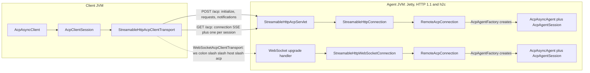

ACP's wire rules for Streamable HTTP and WebSocket come from the transport RFD, not the v1 transports
page (which still calls Streamable HTTP a draft):
[Streamable HTTP and WebSocket Transport](https://agentclientprotocol.com/rfds/streamable-http-websocket-transport).
This page covers this SDK's implementation of it.

## stdio

The default transport: the client spawns the agent as a child process and they exchange
newline-delimited JSON over stdin/stdout. The agent writes its logs to stderr.

**Closing a stdio client lets the agent exit by itself.**
`StdioAcpClientTransport.closeGracefully()` closes the agent's standard input first and waits up to
`END_OF_INPUT_WAIT_MILLIS` (2 seconds) for the agent to exit on its own; only an agent still running
after that gets SIGTERM, and is killed 5 seconds later if it still hasn't stopped. A Java SDK stdio
agent treats end of input as a half-close, not a cancellation: it answers every request already
received, flushes, and exits 0. Exit code 143 now means the agent ignored end of input; 137 means it
was killed. The stop is logged exactly once, even when `close()` follows `closeGracefully()` in a
try-with-resources block.

**`System.in` has a sharp edge.** Closing a `StdioAcpAgentTransport` built on `System.in` does not
release it: its reader thread stays blocked until the next line arrives or input ends, because a read
of `System.in` cannot be interrupted. Pass explicit streams, or use `acp-test`'s in-memory transport,
in embedders and tests.

## Streamable HTTP and WebSocket

### Identity

| Identity | Carried by | Meaning |
|---|---|---|
| `Acp-Connection-Id` | HTTP header, set on the `initialize` response and the WebSocket upgrade | One connection equals one agent from the `AcpAgentFactory` |
| `Acp-Session-Id` | HTTP header on session-scoped POST/GET | Which session's SSE stream a message belongs to |
| `sessionId` | JSON-RPC params | The ACP session; must agree with the header |

### Method routing

| Scope | Methods |
|---|---|
| Connection (no `Acp-Session-Id` needed) | `initialize`, `authenticate`, `logout`, `session/new`, `session/list`, `providers/*`, `$/cancel_request` |
| Session (`Acp-Session-Id` required) | `session/prompt`, `session/set_mode`, `session/set_config_option`, `session/cancel`, `session/close` |
| Session (header optional) | `session/load`, `session/resume` (may pre-open the stream), `session/fork` (uses the parent session), `session/delete` |
| Default (extensions, anything unrecognized) | Session-scoped if the params carry a `sessionId`, otherwise connection-scoped |

Agent-to-client calls (`session/update`, `session/request_permission`, `fs/*`, `terminal/*`) travel
on the session's own stream.

### How a connection becomes an agent



Each new connection, whether an `initialize` POST or a WebSocket upgrade, gets a
`RemoteAcpConnection`, which asks the `AcpAgentFactory` for a fresh agent bound to a
connection-scoped transport. Annotated agents get this through
`AcpAgentSupport.Builder.buildFactory()`; the handler bean it wraps is shared across every
connection, so it must be thread-safe.

```java
AcpAgentFactory agents = AcpAgentSupport.create(new MyAgent()).buildFactory();
var server = new StreamableHttpAcpAgentTransport(0, AcpJsonMapper.createDefault(), agents);
server.start().block();  // http://localhost:<server.getPort()>/acp and ws://.../acp
```

### Plain `http://` is first-class

The client probes with a bodiless GET so an h2c (HTTP/2 cleartext) server can upgrade the connection;
otherwise it falls back to pinned HTTP/1.1. The built-in Jetty listener serves both HTTP/1.1 and h2c,
with `maxConcurrentStreamsPerConnection` defaulting to 1024.

### The mountable servlet

`StreamableHttpAcpServlet(mapper, factory)` works in any Servlet 6 container, with async support
enabled; `init()`/`destroy()` drive its lifecycle.

### Shutdown

Closing the servlet (`destroy()`, `closeGracefully()`) or the standalone listener waits at most
`StreamableHttpAcpAgentTransportOptions.shutdownTimeout` (default 5 seconds) for connected agents to
finish, then closes everything else at once; an `initialize` still in flight when shutdown starts is
answered `503` immediately.

**Under Spring Boot specifically**, graceful shutdown waits for every open SSE stream
(`spring.lifecycle.timeout-per-shutdown-phase`, 30 seconds by default) before `destroy()` even runs.
Call `servlet.closeGracefully()` yourself from a `SmartLifecycle.stop()` in the default phase, rather
than relying on `destroy()` alone, or that 30-second wait looks like a hang.

### Port 0 and other options

Pass port `0` to listen on an ephemeral port; call `getPort()` after `start()` to get the port that
was actually bound. `StreamableHttpAcpClientTransportOptions.maxSseStreams` defaults to 64 (one per
open session, plus the connection stream); raise it if a single client holds many sessions open at
once.

## Not yet supported in 0.80.0

- **WebSocket inside a servlet container.** The servlet serves HTTP/SSE only; the WebSocket upgrade
  needs the standalone Jetty listener (`StreamableHttpAcpAgentTransport`), not
  `StreamableHttpAcpServlet`.
- **HTTP/2 configuration for the servlet.** That's the surrounding container's responsibility, not
  this SDK's.
- **TLS on the built-in listener.** It opens a plain connector only; terminate TLS in front of it, or
  use the mountable servlet in a container that already handles TLS.
- **A client-side listener.** Clients in this SDK only connect; they don't accept inbound connections.

## Related

<CardGroup cols={2}>
  <Card title="Spring Boot: Remote Agents over HTTP" icon="server" href="/docs/acp-java-sdk/autoconfig#remote-agents-over-streamable-http">
    acp-autoconfig's property-driven setup for the servlet and listener cases
  </Card>
  <Card title="Migration Guide" icon="arrow-right-arrow-left" href="/docs/acp-java-sdk/migration-0.80">
    The acp-websocket-jetty removal this transport replaces
  </Card>
</CardGroup>
