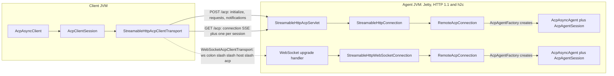

ACP's wire rules for Streamable HTTP and WebSocket come from the transport RFD, not the v1 transports
page (which still calls Streamable HTTP a draft):
[Streamable HTTP and WebSocket Transport](https://agentclientprotocol.com/rfds/streamable-http-websocket-transport).
This page covers this SDK's implementation of it.

## stdio

The default transport: the client spawns the agent as a child process and they exchange
newline-delimited JSON over stdin/stdout. The agent writes its logs to stderr.

**Closing a stdio client lets the agent exit by itself.**
`StdioAcpClientTransport.closeGracefully()` closes the agent's standard input first and waits up to
`END_OF_INPUT_WAIT_MILLIS` (2 seconds) for the agent to exit on its own; only an agent still running
after that gets SIGTERM, and is killed 5 seconds later if it still hasn't stopped. A Java SDK stdio
agent treats end of input as a half-close, not a cancellation: it answers every request already
received, flushes, and exits 0. Exit code 143 now means the agent ignored end of input; 137 means it
was killed. The stop is logged exactly once, even when `close()` follows `closeGracefully()` in a
try-with-resources block.

**`System.in` has a sharp edge.** Closing a `StdioAcpAgentTransport` built on `System.in` does not
release it: its reader thread stays blocked until the next line arrives or input ends, because a read
of `System.in` cannot be interrupted. Pass explicit streams, or use `acp-test`'s in-memory transport,
in embedders and tests.

**The client's own process doesn't exit when the agent process does.**
`StdioAcpClientTransport.awaitProcessExit()` (renamed from `awaitForExit()`) blocks until the agent
process itself exits, as distinct from `awaitTermination()`, which completes when the *transport*
ends (which can happen first, for instance on a graceful close). A thread blocked in
`awaitProcessExit()` that's interrupted throws `CancellationException` with the interrupt flag kept.
Sending through a transport after it's closed fails with `AcpConnectionException` ("The transport is
closed") rather than silently dropping the message and leaving the caller to wait out a timeout.

**The agent process inherits the client's whole environment by default.** Every environment variable
the client process has, including secrets, reaches the agent subprocess unless you say otherwise.
`AgentParameters.Builder.inheritEnvironment(false)` starts the process from an empty environment
instead, with only the "safe" defaults (`HOME`, `LOGNAME`, `PATH`, `SHELL`, `TERM` and `USER`; on
Windows, a different, larger set) and whatever `addEnvVar(...)` adds on the builder:

```java
var params = AgentParameters.builder("my-agent")
    .inheritEnvironment(false)
    .addEnvVar("GEMINI_API_KEY", apiKey)   // the only secret this agent actually needs
    .build();
```

## Streamable HTTP and WebSocket

### ACP over HTTP needs almost nothing from a web framework

| A general web abstraction has | ACP needs |
|---|---|
| Routing, path variables, many endpoints | One path, `/acp` |
| Every HTTP method | `POST`, `GET`, `DELETE` |
| Content negotiation, multipart, cookies, forms | A JSON body in, a few known headers |
| Arbitrary response types | Three replies: JSON, empty, or an SSE stream |
| Binary frames, extensions | WebSocket text frames |
| Filters, interceptors, middleware | None: the framework's own run before the host |

The host contract is about eight small types, and a host is a few hundred lines. That's why each
framework's integration is a thin layer rather than a reimplementation of the protocol.

### Identity

| Identity | Carried by | Meaning |
|---|---|---|
| `Acp-Connection-Id` | HTTP header, set on the `initialize` response and the WebSocket upgrade | One connection equals one agent from the `AcpAgentFactory` |
| `Acp-Session-Id` | HTTP header on session-scoped POST/GET | Which session's SSE stream a message belongs to |
| `sessionId` | JSON-RPC params | The ACP session; must agree with the header |

### Method routing

| Scope | Methods |
|---|---|
| Connection (no `Acp-Session-Id` needed) | `initialize`, `authenticate`, `logout`, `session/new`, `session/list`, `providers/*`, `$/cancel_request` |
| Session (`Acp-Session-Id` required) | `session/prompt`, `session/set_mode`, `session/set_config_option`, `session/cancel`, `session/close` |
| Session (header optional) | `session/load`, `session/resume` (may pre-open the stream), `session/fork` (uses the parent session), `session/delete` |
| Default (extensions, anything unrecognized) | Session-scoped if the params carry a `sessionId`, otherwise connection-scoped |

Agent-to-client calls (`session/update`, `session/request_permission`, `fs/*`, `terminal/*`) travel
on the session's own stream.

### How a connection becomes an agent



Each new connection, whether an `initialize` POST or a WebSocket upgrade, gets a
`RemoteAcpConnection`, which asks the `AcpAgentFactory` for a fresh agent bound to a
connection-scoped transport. Annotated agents get this through
`AcpAgentSupport.Builder.buildFactory()`; the handler bean it wraps is shared across every
connection, so it must be thread-safe.

```java
AcpAgentFactory agents = AcpAgentSupport.create(new MyAgent()).buildFactory();
var server = new StreamableHttpAcpAgentTransport(0, AcpJsonMapper.createDefault(), agents);
server.start().block();  // http://localhost:<server.getPort()>/acp and ws://.../acp
```

### Plain `http://` is first-class

The client probes with a bodiless GET so an h2c (HTTP/2 cleartext) server can upgrade the connection;
otherwise it falls back to pinned HTTP/1.1. The built-in Jetty listener serves both HTTP/1.1 and h2c,
with `maxConcurrentStreamsPerConnection` defaulting to 1024.

### The mountable servlet

`StreamableHttpAcpServlet` (module `acp-http-servlet`, no Jetty dependency) works in any Servlet 6
container, with async support enabled; `init()`/`destroy()` drive its lifecycle.
`StreamableHttpAcpServlet(mapper, factory)` and the mapper-less `StreamableHttpAcpServlet(factory)`
(defaulting to `AcpJsonMapper.createDefault()`) both still exist, alongside the newer
`StreamableHttpAcpServlet(AcpHttpEndpoint)`, which wraps a host contract you've built or customized
yourself. Every protocol rule (routing, sessions, the Origin check, keep-alive) lives behind that
`AcpHttpEndpoint` contract; the servlet's own `service()` method hands every request straight to it, so
a subclass overriding `doGet`, `doPost` or `doDelete` no longer intercepts anything.

The servlet upgrades WebSocket requests itself, through Jakarta WebSocket 2.1
(`ServerContainer.upgradeHttpToWebSocket`), on any container that has an implementation (Tomcat, Jetty,
Undertow); a container without one answers the upgrade `501`.

### A mountable WebFlux route

`AcpWebFluxHost` (module `acp-http-webflux`) is the same idea for a plain Spring WebFlux application,
with no Spring Boot autoconfiguration involved: `new AcpWebFluxHost(endpoint).routerFunction("/acp")`
returns a `RouterFunction<ServerResponse>` you add to your own router, Streamable HTTP and WebSocket on
that one path. It depends only on the host contract and `spring-webflux` (provided), so it works in any
WebFlux application, Spring Boot or not.

### Shutdown

Closing the servlet (`destroy()`, `closeGracefully()`) or the standalone listener waits at most
`StreamableHttpAcpAgentTransportOptions.shutdownTimeout` (default 5 seconds) for connected agents to
finish, then closes everything else at once; an `initialize` still in flight when shutdown starts is
answered `503` immediately. Every open stream is drained first: an SSE stream gets a closing comment
(`: shutting down`) before it completes, and a WebSocket closes with code `1001` (going away), not
`1000`, so a client distinguishing a normal close from a server shutdown sees the right one.

SSE responses also carry `Cache-Control: no-cache` and `X-Accel-Buffering: no`, so nginx and similar
reverse proxies don't buffer them; `text/event-stream` is excluded from Spring Boot's own response
compression automatically, since a compressed SSE stream would otherwise sit in the compressor's
buffer instead of reaching the client as it's written.

**Under Spring Boot specifically**, graceful shutdown waits for every open SSE stream
(`spring.lifecycle.timeout-per-shutdown-phase`, 30 seconds by default) before `destroy()` even runs.
Call `servlet.closeGracefully()` yourself from a `SmartLifecycle.stop()` in the default phase, rather
than relying on `destroy()` alone, or that 30-second wait looks like a hang.

### Port 0 and other options

Pass port `0` to listen on an ephemeral port; call `getPort()` after `start()` to get the port that
was actually bound. `StreamableHttpAcpClientTransportOptions.maxSseStreams` defaults to 64 (one per
open session, plus the connection stream); raise it if a single client holds many sessions open at
once.

### Running on your own executor

`StreamableHttpAcpClientTransportOptions.builder().executor(Executor)`,
`new WebSocketAcpClientTransport(URI, AcpJsonMapper, Executor)`, and
`StreamableHttpAcpAgentTransportOptions.builder().executor(Executor)` run the transport's own work (the
`HttpClient`, SSE reads, frame writes, or, for the listener, every request on Jetty's
`VirtualThreadPool`) on an executor you supply, instead of one the transport creates and owns; nothing
shuts it down, since the application owns it. On JDK 21 and later, each of these defaults to virtual
threads unless you pass your own executor; `virtualThreads(false)` on the same builders keeps
platform-thread pools instead, for an application that hasn't opted into virtual threads.

## Deployment topologies

Where ACP actually listens depends on how the agent is built and served. One table, one port column
each:

| How the agent is served | ACP HTTP + WebSocket | The app's own traffic (if any) |
|---|---|---|
| Plain Java (no framework) | One port, the SDK's own server | n/a |
| Quarkus | Quarkus's own HTTP port, alongside the app's routes | Same port |
| Micronaut | A second port (`acp.agent.transport.http.listener.port`) | Micronaut's own port (`micronaut.server.port`) |
| Spring Boot, non-web application | One port, the SDK's own server | n/a |
| Spring Boot, servlet web application | The app's own port, HTTP, SSE and WebSocket together | Same port |
| Spring Boot, reactive (WebFlux) web application | The app's own port, HTTP, SSE and WebSocket together | Same port |

- **Plain Java**, with no framework at all: the SDK's own server serves ACP over HTTP and WebSocket on
  one port.
- **Quarkus** serves ACP over HTTP and WebSocket on Quarkus's own HTTP port, alongside the
  application's other routes. One server.
- **Micronaut** keeps the application's own traffic on Micronaut's server
  (`micronaut.server.port`), while ACP over HTTP and WebSocket runs on a second port
  (`acp.agent.transport.http.listener.port`). Two servers in one JVM: two ports, and separate TLS, security and
  metrics configuration for each.
- **A Spring Boot servlet web application** (a container such as Tomcat) serves ACP over HTTP, SSE and
  WebSocket, all on the application's own port, through the mounted servlet and the application's own
  filter chain: one server, no second port.
- **A Spring Boot reactive (WebFlux) web application** serves ACP the same way, on the application's
  own port (Reactor Netty by default), as a `RouterFunction` routed through the application's own
  `WebFilter`s: one server, no second port.
- **A Spring Boot non-web application** has no servlet or reactive web container, so the SDK's own
  server serves ACP over HTTP and WebSocket on its own port, the same shape as plain Java.

Wherever the SDK's own listener serves ACP, that port binds `127.0.0.1` by default, not every
interface: plain Java, Micronaut's second port, and a Spring Boot non-web application. See
**Safe by default** below for how to expose it deliberately.

<Note>
**Planned**: the same one-port treatment for Micronaut, mounting ACP on Micronaut's own server
instead of a second port. Not available yet. Spring Boot's servlet and reactive (WebFlux) web
applications both already serve WebSocket on their application port, alongside HTTP and SSE, as of
this release.
</Note>

<Tip>
**Safe by default.** The SDK's own listener binds `127.0.0.1` (and `::1` where available), not every
interface, so only programs on the same machine can reach it unless you ask otherwise. To expose it,
set the host explicitly: `spring.acp.agent.transport.http.listener.host` (Spring Boot), Micronaut's
`acp.agent.transport.http.listener.host`, or, in plain Java,
`StreamableHttpAcpAgentTransportOptions.builder().host(...)`. Quarkus serves ACP on its own HTTP
server, so it uses Quarkus's own `quarkus.http.host` instead.

A browser page on another origin can't reach your agent either: it gets 403, over HTTP and on the
WebSocket handshake. Requests with no `Origin` header (this SDK's own client, most IDEs) and
localhost origins are always allowed. To allow a browser application, list its origin:
`spring.acp.agent.transport.http.allowed-origins`, `acp.agent.transport.http.allowed-origins`
(Micronaut), `quarkus.acp.agent.transport.http.allowed-origins`, or the builder's
`allowedOrigins(...)`. `*` allows any origin, which disables the protection.
</Tip>

<Tip>
**Handled for you.** Proven by the SDK's own shared transport TCK, run against the servlet on Tomcat
11 and Jetty 12.1, the embedded listener, and Spring MVC.

- SSE responses aren't buffered by a reverse proxy such as nginx.
- Long-lived streams aren't cut off by the servlet container's own timeouts.
- Concurrent WebSocket writes are safe on every container.
- Shutdown closes open streams promptly.
</Tip>

## Logging and sensitive data

At INFO and above, the SDK logs no message content. A malformed message that fails validation is
refused with an exception naming only the field at fault, never the message text; the WebSocket
client logs its endpoint as scheme, host, port and path, never the query string (which can carry an
access token) or user information (which can carry a password); and a peer's error answer is logged
at WARN by its code and the SDK's own description of it (`-32603 Internal error`), with the peer's
own message and data logged at DEBUG only, since that text is the peer's, not the SDK's.

Two things still bypass this by design:

- **The agent's standard error.** `StdioAcpClientTransport` logs every line a stdio agent writes to
  standard error at INFO, unfiltered, on `com.agentclientprotocol.sdk.client.transport.agent-stderr`:
  an agent's own diagnostics can carry sensitive data (paths, prompts, account details). Silence it
  by setting that logger's level to `WARN` or `OFF`, or route the lines yourself with
  `setStdErrorHandler`.
- **DEBUG and TRACE.** Below INFO, loggers under `com.agentclientprotocol.sdk` log message payloads
  in full: the stdio client's sent and received lines, session messages, and the session updates the
  framework integrations log by default when no update handler of your own is registered. Don't
  enable DEBUG or TRACE on this package where logs are shipped or retained.

## Not yet supported in 0.80.0

- **WebSocket mounted on Micronaut's own server.** Still a second port; see
  [Deployment topologies](#deployment-topologies) above for what's planned here.
- **HTTP/2 configuration for the servlet.** That's the surrounding container's responsibility, not
  this SDK's.
- **TLS on the built-in listener.** It opens a plain connector only; terminate TLS in front of it, or
  use the mountable servlet in a container that already handles TLS.
- **A client-side listener.** Clients in this SDK only connect; they don't accept inbound connections.
- **An oversized request can surface as a connection error instead of 413, on some hosts.** The
  endpoint refuses a body over `maxPostBodyBytes` (16 MiB) by its `Content-Length`, before reading
  it. On Tomcat as a WebFlux server, and on Jetty, the connection can then close while the body is
  still arriving, and a client still sending can lose the 413 it already received to that reset. The
  request is refused either way; a valid request is unaffected. Tomcat as a servlet container
  (Spring MVC) and Reactor Netty aren't affected. A fix is planned for 0.81.0.

## Related

<CardGroup cols={2}>
  <Card title="Spring Boot: Remote Agents over HTTP" icon="server" href="/docs/acp-java-sdk/autoconfig#remote-agents-over-streamable-http">
    acp-autoconfig's property-driven setup for the servlet and listener cases
  </Card>
  <Card title="Migration Guide" icon="arrow-right-arrow-left" href="/docs/acp-java-sdk/migration-0.80">
    The acp-websocket-jetty removal this transport replaces
  </Card>
</CardGroup>
