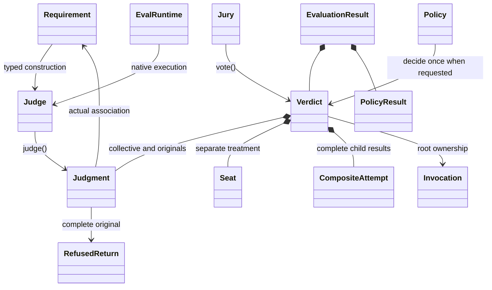

<Note>
This guide describes the Agent Eval 0.18 source API. Maven coordinates and Java packages still use `agent-judge` and `io.github.markpollack.judge`.
0.18.0-SNAPSHOT is a source build, not a released or BOM-managed version.
Use the [exact-source setup](/docs/agent-judge/getting-started#build-the-source-artifacts) before running these examples.
</Note>

| Package under `io.github.markpollack.judge` | Public responsibility |
|---|---|
| root | `Judge`, metadata contracts and combinators |
| `requirement` | `Requirement<S>`, source, general requirements, explicit `AllOf` specifications |
| `construction` | Judge recipes/evidence steps, `NonEmptyJudge` |
| `jury` | `Jury`, construction, `Assignments`, ready panels, meta and cascade execution |
| `judgment` | `Judgment`, `Finding`, `Check`, complete `RefusedReturn` |
| `verdict` | `Verdict`, `Seat`, attempts, provenance, `InvocationRecords`, derived semantics |
| `voting` | `Ballot`, `Participation`, strategies, retained rule configuration and factories |
| `execution` | `EvalRuntime<Q,A>`, `NativeExecution<A>`, `RequirementRequest<S,E>` |
| `ai.model` | `EvalModel`, request/response/options, `EvalMessage`, generated input capability |
| `ai.requirements` | Native requirements, RFC/EARS Judge/Jury, native codec registrations |
| `policy`, `evaluation` | Reliance policy, optional attribution, complete `EvaluationResult` |
| `portable`, `description` | Portable values/limits and pure pre-execution descriptions |
| `json` | Thin `EvalJsonMapper` mechanics port |
| `serialization` | Supported converters/codecs in `agent-judge-json-jackson2` |
| `assertj`, `assertions` | Optional fluent/retained assertion modules |

`Judge.judge()` and `Jury.vote()` take no execution argument. Construction binds the actual requirement/roster, evidence and lower runtime.
`EvalRuntime.execute(request)` returns the native answer and its Invocation; `EvalModel.generate(request)` supplies a generated answer.
A Verdict retains collective and individual judgments, seats, children/attempts, roster or explicit parent, provenance, and invocation owners.
`conclusion()` derives PASS, FAIL, INCONCLUSIVE, or NOT_APPLICABLE. `requireUsable()` validates and returns the unchanged object.

Core owns no Jackson engine. Add the supported Jackson 2 module explicitly; use `NativeRequirementCodecs.codec()` for RFC/EARS values and `VerdictCodec` for text/AllOf.
Descriptions stay V3; results/evaluations use V6.

Current source: [producer README](https://github.com/markpollack/agent-judge/blob/0d0abe47b34c0e638e68ed81c5a764d6b424bc86/README.md), [writing judges](https://github.com/markpollack/agent-judge/blob/0d0abe47b34c0e638e68ed81c5a764d6b424bc86/writing-judges.md), [describing juries](https://github.com/markpollack/agent-judge/blob/0d0abe47b34c0e638e68ed81c5a764d6b424bc86/describing-juries.md), [V6 storage](https://github.com/markpollack/agent-judge/blob/0d0abe47b34c0e638e68ed81c5a764d6b424bc86/portable-results-v6.md).
These pinned sources are distinct from released 0.17 Javadoc.
